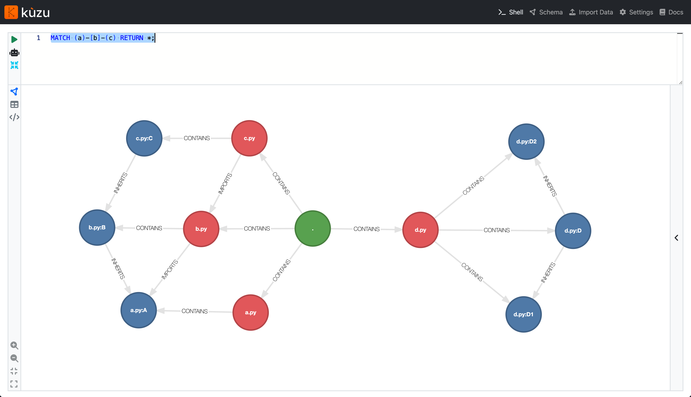

# CodeGraph

## Prerequisites

Install dependencies:

```bash
pip install -r requirements.txt
```

Download (and unarchive) the Kuzu CLI from [Kuzu GitHub Releases](https://github.com/kuzudb/kuzu/releases):

```bash
curl -LO https://github.com/kuzudb/kuzu/releases/download/v0.10.0/kuzu_cli-osx-universal.tar.gz
tar -xzvf kuzu_cli-osx-universal.tar.gz
```

## Quick Start

### Initialize the database

Create the database:

```bash
./kuzu ./graph/db < ./graph/schema.cypher
```

Install the JSON extension for Kuzu:

```bash
echo "INSTALL json;" | ./kuzu ./graph/db
```

### Parse code and import graph

```bash
python parser.py examples --output=./graph/data
```

### Explore the graph

```bash
make run-explorer
```

Open `http://localhost:8888` to view the data.

<p align="center">

</p>